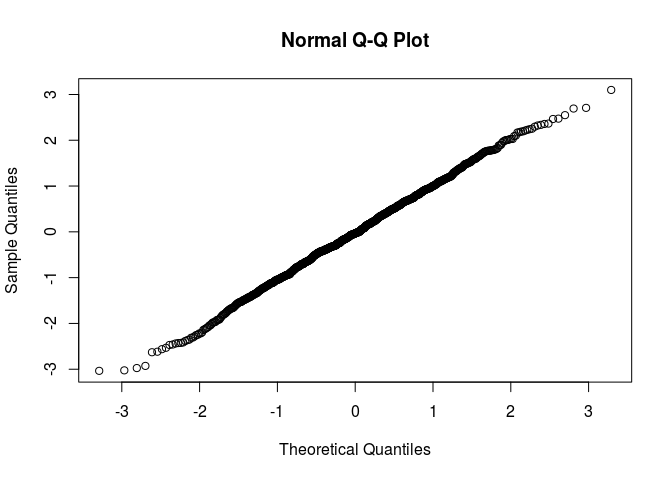
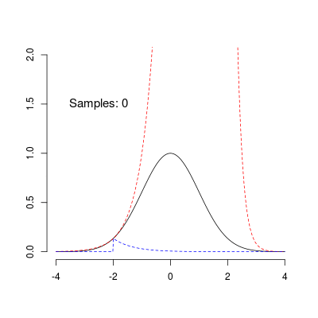

Adaptive Rejection Sampler
================
Philipp Hunziker
June 3, 2018

A very fast univariate Adaptive Rejection Sampler for R, implemented in C++.

Installation
------------

``` r
devtools::install_github('hunzikp/arscpp')
```

Quick Start
-----------

Sample from the standard normal distribution:

``` r
# Normal log pdf
f <- function(x, mu, sd) {
  -0.5*(sd^(-2))*(x-mu)^2
}

# Derivative of normal log pdf
f_prime <- function(x, mu, sd) {
  -1*(sd^(-2))*(x-mu)
}

# Prepare the sampler
sampler <- arscpp::ars(f = f, f_prime = f_prime, x = c(-1, 1), 
                       mu = 0, sd = 1)

# Draw 1e4 samples
set.seed(1)
x <- sampler$sample(1000)
qqnorm(x)
```



Adaptive Rejection Sampling
---------------------------

The `arscpp` package implements the Adaptive Rejection Sampling (ARS) algorithm by Wild and Gilks (1993, Algorithm AS 287). ARS allows sampling from abritrary univariate log-concave densities. Importantly, the density does not have to be normalized, so ARS is particularly useful for Bayesian inference problems.

Without going into any detail, ARS works by building a piecewise log-linear density function (called the 'upper hull') that serves as a proposal distribution for the rejection sampler. In addition, the algorithm defines a piecwise log-linear lower-hull that allows performing the rejection step without having to evaluate the target density at every iteration. The algorithm is 'adaptive' because the upper and lower hulls get adjusted to fit the target density more closely with every rejected sample. The animation below illustrates this procedure, showing the sampling of 100 samples from an unnormalized standard normal distribution using ARS. The red and blue lines correspond to the upper and lower hulls, respectively. The animation shows nicely how ARS leads to a near optimal proposal distribution as the number of samples increases. 

Implementation Details
----------------------

`arscpp` is implemented in C++ using the excellent [Rcpp](https://cran.r-project.org/package=Rcpp) package, with a focus on speed and user-friendliness. `arscpp` is quite a bit faster than the implementation provided in the [ars](https://cran.r-project.org/package=ars) package:

``` r
# Prepare the arscpp sampler (this package)
sampler <- arscpp::ars(f = f, f_prime = f_prime, x = c(-2, -1, 1), 
                       mu = 0, sd = 1)
ars_new_sample <- function() {sampler$sample(1000)}

# Prepare the sampler from the 'ars' package
ars_old_sample <- function() {ars::ars(n = 1000, f = f, fprima = f_prime, x = c(-2, -1, 1), 
                                     mu = 0, sd = 1)}

# Benchmark
library(rbenchmark)
res <- benchmark(
  "arscpp" = ars_new_sample(),
  "ars" = ars_old_sample()
)
print(res)
```

    ##     test replications elapsed relative user.self sys.self user.child
    ## 2    ars          100   1.292   27.489     1.292        0          0
    ## 1 arscpp          100   0.047    1.000     0.048        0          0
    ##   sys.child
    ## 2         0
    ## 1         0

`arscpp` also tries to provide a 'black-box' implementation where the user does not have to worry about providing correct starting values (see the Wild and Gilks article for details). Instead, upon encountering invalid starting values, `arscpp` seeks new ones, e.g.:

``` r
# Try invalid starting values with 'ars' implementation
smp <- ars::ars(n = 1, f = f, fprima = f_prime, x = c(1,2,3), mu = 0, sd = 1)
```

    ## 
    ## Error in sobroutine initial_...
    ## ifault= 3

``` r
# Try invalid starting values with 'arscpp'
sampler <- arscpp::ars(f = f, f_prime = f_prime, x = c(1,2,3), mu = 0, sd = 1)
smp <- sampler$sample(1)
print(smp)
```

    ## [1] 0.06754326

C++ Extensions
--------------

If you'd rather use the `arscpp` from within C++ you should be able to do so quite easily using run-time polymorphism. Simply extend the `LogDensity` abstract class and implement all the virtual functions. The main AR sampler in `arcpp` is defined in class `ARS`, which takes a pointer to a `LogDensity` child object as a constructor parameter.
